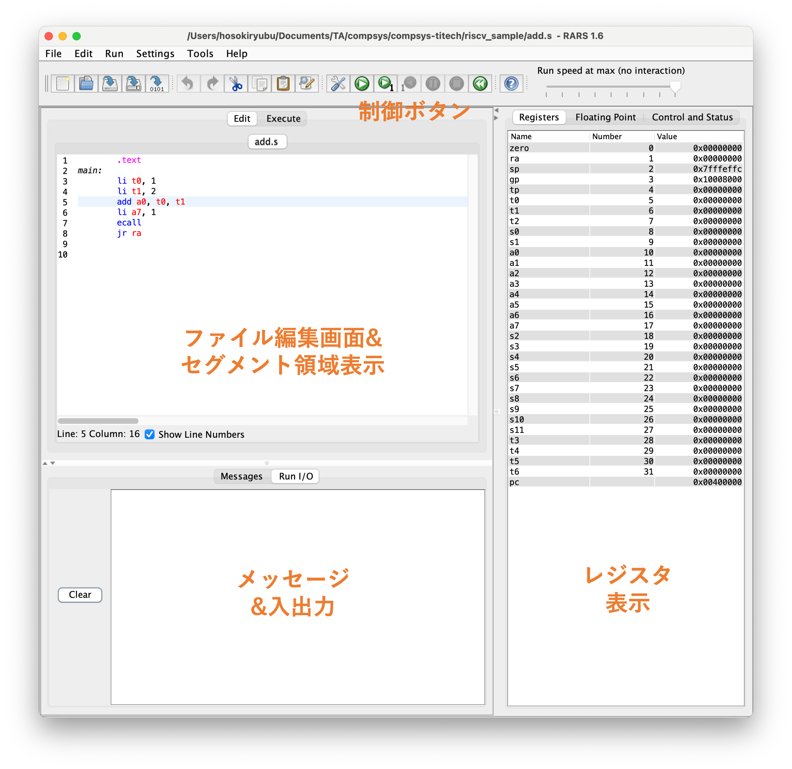
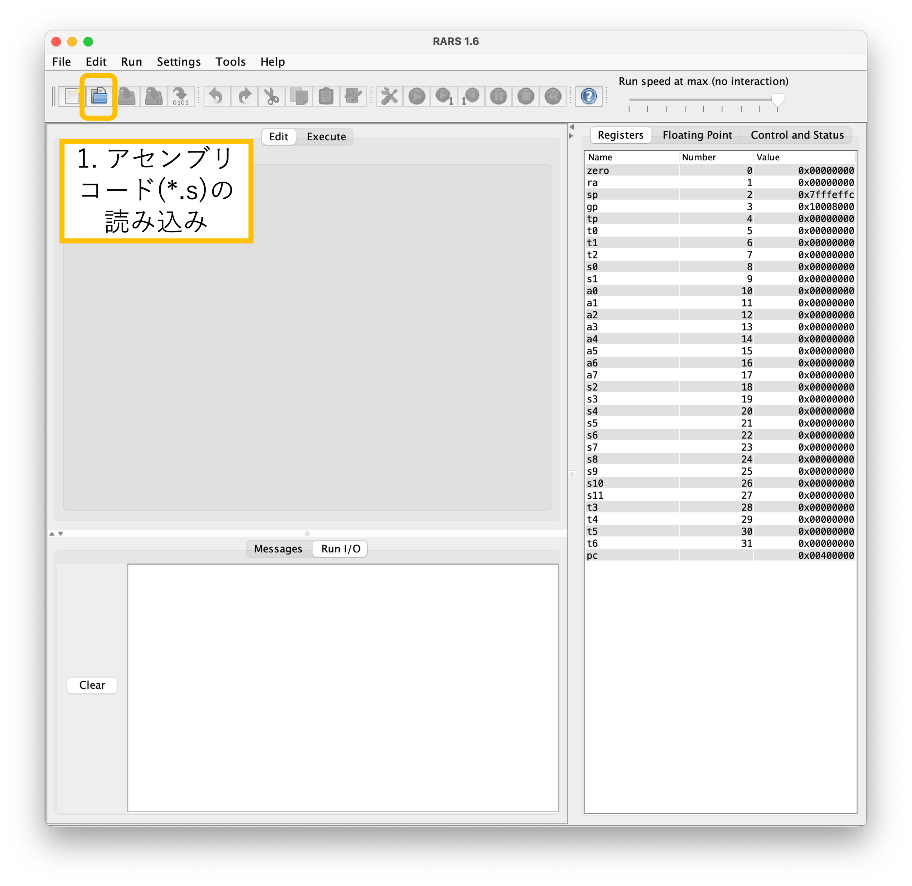
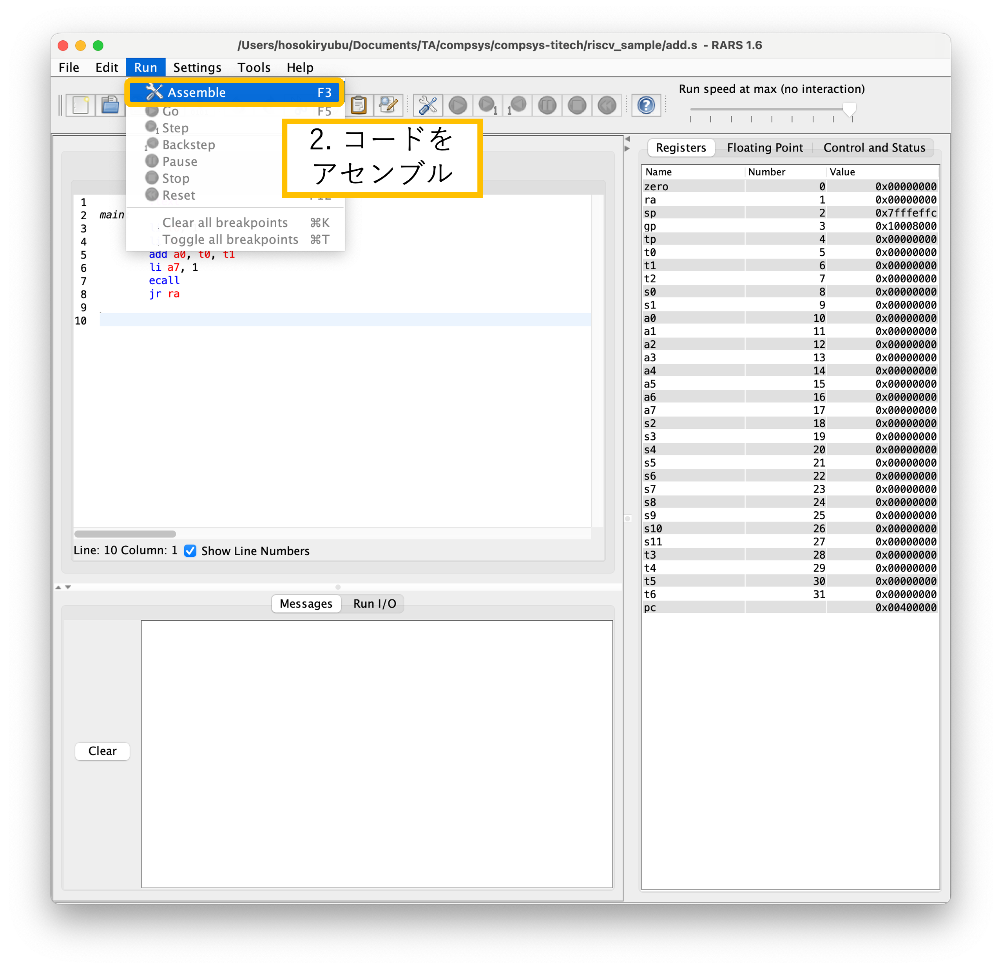
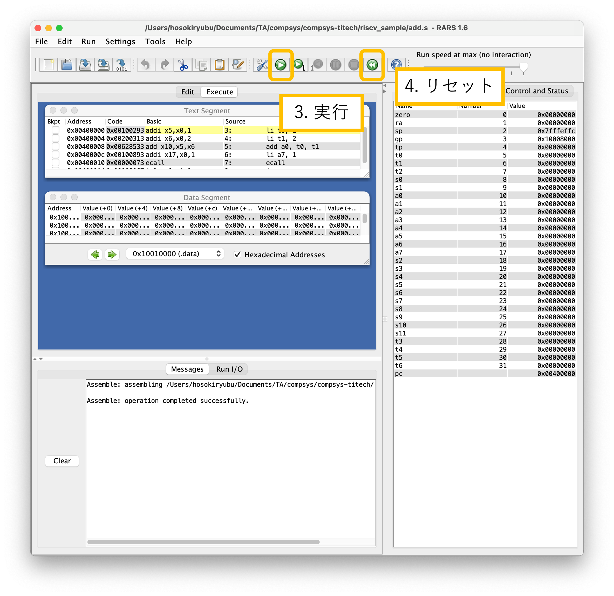

# riscv_sample

RISC-Vアセンブリ言語のサンプルプログラム

RISC-V命令の一覧はT2SCHOLAの資料を参照してください


## RISC-Vシミュレータ RARS

[RARS (RISC-V Assembler and Runtime Simulator)](https://github.com/TheThirdOne/rars) はJavaで作成されたRISC-Vシミュレータ

### インストール

#### Java環境の確認

```
java --version
```

`java`コマンドがない場合や使えない場合は、Java環境をインストールしてください

#### ダウンロード

以下のurlからファイルをダウンロード  
https://github.com/TheThirdOne/rars/releases/download/v1.6/rars1_6.jar


### 起動方法

ダウンロードしたファイルがあるディレクトリで次のコマンドを実行

```
java -jar rars1_6.jar
```


### 使い方

> [!NOTE]
> Settings > "Initialize Program Counter to global 'main' if defined" をチェック










